# Machine Learning Engineer Nanodegree
## Capstone Project
Nathan Zylbersztejn
December 18th, 2016

## I. Definition

### Project Overview
The goal of this project is to implement a solution to Udacity Deep Learning Course ud730's final project: train a model that can decode sequences of digits from natural images. The model will be trained on the [The Street View House Numbers (SVHN) Dataset](http://ufldl.stanford.edu/housenumbers/) 1 and I will follow the approach of the reference paper Ian J. Goodfellow, Yaroslav Bulatov, Julian Ibarz, Sacha Arnoud, Vinay Shet (2014). _Multi-digit Number Recognition from Street View_

### Problem Statement
Given an image of arbitrary size and an indication about the position of the street number in this image, to what extent is a model able to recognize it and identify correctly each of its digits? How accurate can it be? Reading characters in a picture is a difficult problem and the objective of this project is to bring a decent solution for a subset of it, a street number, which is a sequence of up to 5 digits. My objective is to develop a sound theoretical and practical understanding of Convolutional Neural Networks, and to gain the ability to implement training at scale (deep model with a lot of data) with Tensorflow. Therefore I will follow the tracks of _Goodfellow et Al, 2014_2, even if others seem to have found better performing architectures3.

To make the model development easier I will start from a synthetic dataset generated from the [MNIST dataset](http://yann.lecun.com/exdb/mnist/) 4. The same street numbers as in the original SVHN dataset but made of random digits from MNIST on a white backround. This removes many of the difficulties related to noisy data and will allow me to focus on the essentials such as implementing a simple network with a loss function that satisfies the objective. The simplicity of the synthetic dataset will hopefully avoid having to deal with deep architectures and complex hyperparameters tuning right from the beginning.

The final model will be trained with a considerable amount of (augmented) data on [Google Cloud ML](cloud.google.com/ml‎), Google's Tensorflow as a service platform. Distributed training requires a proper implementation of the data pipeline and to coordinate training units each running in concurrent threads. That is where the main focus will be.

### Metrics
A street number is a sequence of digits. I will use one classifier `L` for the length (# of digits) and one classifier `Di` for the value of each digit where `i` is the position of the digit. We want to maximize:

    P(L=LL) x Product over i of P(Di=DDi)
      for i in [0,LL)

where `P(A=AA)` denotes the probability that a prediction `A` equals the true value `AA`

Our model will always give 1 prediction for length and 6 predictions for digits. The length is used to discard digits prediction that fall out of it. Let's say the we're trying to predict the number 123. The model output could be L=3 and D=[1,2,3,4,5,6]. As long as Di = DDi for i in [0,L), the prediction is correct. The accuracy is calculated on this basis.

In Tensorflow we minimize a loss instead of maximizing a probability. We minimize the loss for the length and for each digit. Minimizing the loss below is equivalent to maximizing the probability above:

    LOSS = loss(L vs LL) + Sum over i of loss(Di vs DDi)
      for i in [0,LL)

It is very important not to account for any digits out of length as we don't want them to influence the modification of weights during the back propagation pass.

## II. Analysis

### Data Exploration

The SVHN dataset comes in two flavors.

- **Format 1**: pictures of various sizes and resolutions of full street numbers accompanied with metadata containing bounding boxes coordinates for each digit. The training set contains 73257 pictures, the testing set 26032 and there is an _extra_ dataset of 531131 additional samples described as _somewhat less difficult_. The images are in .png formats and the metadata file is provided as a Matlab .mat file.
- **Format 2**: Cropped 32x32 digits in a Matlab file file format

We won't use Format 2 as we'll follow Goodfellow et Al's approach of feeding the model with images of street numbers. So we'll use Format 1 dataset.

Here is an sample of the metadata. The first two rows contain digit information of image `1.png`, which has value 19.

|FileName|DigitLabel|Left|Top|Width|Height
|--- |--- |--- |--- |--- |--- |--- |
|1.png|1|246|77|81|219|
|1.png|9|323|81|96|219|
|2.png|2|77|29|23|32|
|2.png|3|98|25|26|32|

Below are the two images referenced in the above sample

The first two images of the training set show very diverse dimensions. Let's have a look at the distrubution of dimensions. This may impact our preprocessing strategy as we will probably have to feed our model with images of fixed dimensions.

The histograms below show the distributions of width (green) and height (blue) accross the training dataset

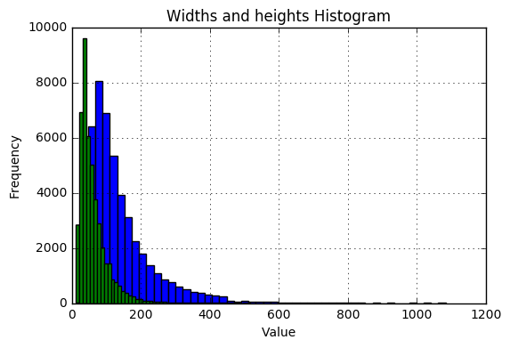
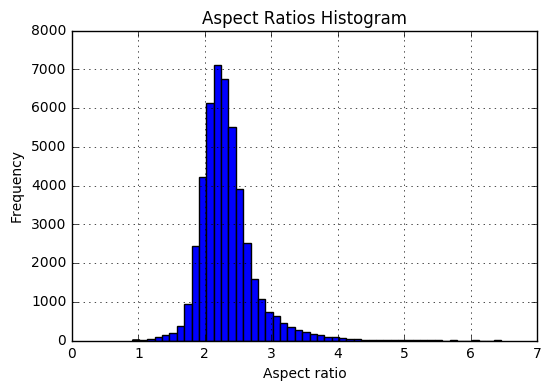

Finally, street numbers may have up to 5 digits which means their values are between 1 and 99999. Let's see in practices how street numbers are distributed.

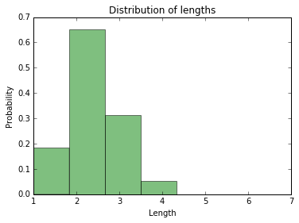

As we could have guessed, most street numbers have one to three digits. About 4% have 4 digits, and the proportion of street numbers with 5 digits or more are negligible. There is one instance of a 7 digits street number.

More details can be found in the notebook `1. Getting and exploring data.ipynb`.

In addition to the original SVHN dataset I will generate a simpler dataset from MNIST digits as building material. Here is a sample of this dataset. It has the same size and contains the same values as the original SVHN dataset. The numbers are randomly placed on a white 64x64 canvas. The choice of those dimensions is explained later in the preprocessing section.

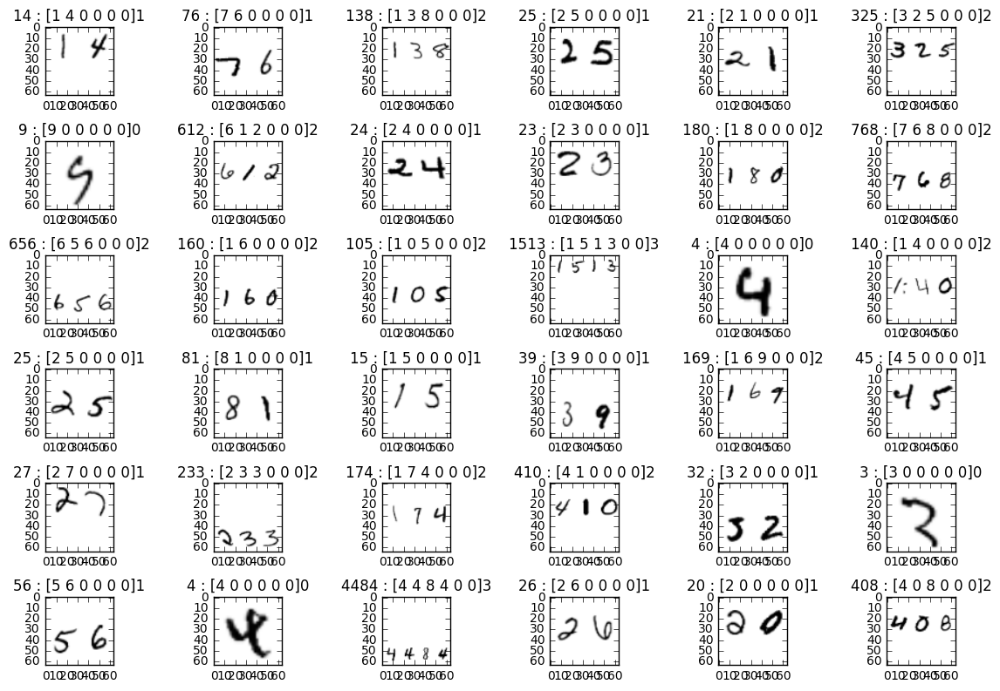

Details about the generation of this dataset can be found in the notebook `2. Synthetic Dataset.ipynb`.

### Algorithms and Techniques
As written above this project follow the tracks of Goodfellow et Al, and the final model I will implement is very close. I want to train the model at scale and therefore the focus was more on the software engineering part of the task than on innovating with new architectures. Feeding the model with large amount of data in the form of numpy arrays doesn't scale well because this approach requires keeping the whole dataset in memory instead of only the samples used in the current batches, and deep models with loads of params require a lot of memory and computational power as well, so dealing with this kind of constraint will probably be necessary for future projects as well.

TensorFlow comes with a framework to feed large amounts of data in smaller chunks. Tensorflow also allows to distribute and coordinate the training on different machines, and using those features is required when training on Google Cloud ML.

Once preprocessed, the data will be stored in a Google Cloud Storage bucket from which our model will be fed.

### Benchmark
The benchmark here is the accuracy obtained in the paper: 96%.

## III. Methodology

### Data Preprocessing
The first step was to recompile the meta data table in an easier to read and use format. Here is a sample. Having all the street number information and image dimensions in one row will be handy for the next steps.

| filename | value | digits | length | width | height | box                 |   |
|----------|-------|--------|--------|-------|--------|---------------------|---|
| 1.png    | 19.0  | [1, 9] | 2.0    | 741.0 | 350.0  | [246, 77, 419, 300] |   |
| 2.png    | 23.0  | [2, 3] | 2.0    | 199.0 | 83.0   | [77, 25, 124, 61]   |   |
| 3.png    | 25.0  | [2, 5] | 2.0    | 52.0  | 23.0   | [17, 5, 34, 20]     |   |
| 4.png    | 93.0  | [9, 3] | 2.0    | 161.0 | 79.0   | [57, 13, 85, 47]    |   |
| 5.png    | 31.0  | [3, 1] | 2.0    | 140.0 | 68.0   | [52, 7, 89, 56]     |   |

About 50 street numbers had 0 values, with all digits having 0 values too. Those have been removed from the datasets (training and test). Details can be found in the preprocessing notebook. [REF]

#### Data Transformation

I will preprocess the data as follows:
1. Increase the bounding box by 30% and crop around it.
2. Resize the resulting image to 74x74 pixels
3. Crop a random 64x64 image from the 74x74 image above.

It's 10 pixels more than on the paper which ends up with 54x54 images, but powers of two were easier to manage along the convolutional layers stack.

**Validation and Test sets**

It is not clear in the paper if the same preprocessing has been applied to the validation and the test sets. Random crops in the test set makes it unique to an implementation and results are less comparable. On the other hand, skipping the last step (3) requires to resize to 64x64 instead of 74x74 which creates a scale variation between training and test data.

The validation set is a random extraction of 10% of the training data. I resized it to 74x74 in step 2 to avoid random crops.

I created two versions of the test set, one preprocessed as the training data (Test set 1), one preprocessed as the validation data (Test set 2).

#### Data Augmentation
I didn't use the `extra` data set. Dealing with limited data and overfitting seemed like a better learning opportunity.

I augmented the dataset 20 times. Random crops (step 3 above) make those virtually unique, but not that unique. Flips can obviously not be used here. I tried random rotations (up to 8 degrees) but it didn't make a difference so I did not keep them. Goodfellow doesn't mention using rotations, and benchmarks made on state of the art models with usual images datasets by _Dmytro Mishkin et Al (2016)_5 indicate no improvement neither.

I also used color perturbations à la Krizhevsky/Alexnet. Quoting him :
> altering the intensities of the RGB channels in training images. Specifically, we perform PCA
> on the set of RGB pixel values throughout the ImageNet training set.
> To each training image, we add multiples of the found principal
> components, with magnitudes proportional to the corresponding
> eigenvalues times a random variable drawn from a Gaussian
> with mean zero and standard deviation 0.1.

Here is a sample, and as one can see the differences are rather subtle:
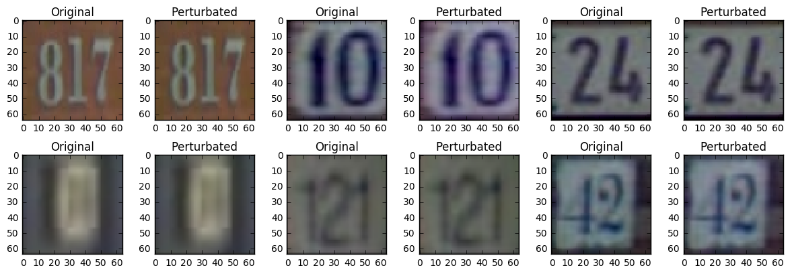

Applying these perturbations to our images allows to augment our dataset by adding the same images with slight variations of colors and lighting. Somehow it's equivalent to taking pictures of the same street numbers under different lighting and weather conditions.

The preprocessing is thoroughly documented in the notebook `4. Svhn Data preprocessing.ipynb`

### Implementation

#### Process
I wanted to start from from Goodfellow's architecture, which is described in the paper as follow:

> Our best architecture consists of eight convolutional hidden layers, one locally connected hidden layer, and two densely connected hidden  layers. All connections are feedforward and go from one layer to the  next (no skip connections). The first hidden layer contains maxout units (with three filters per unit) while the others contain rectifier units. The number of units at each spatial location in each layer is [48, 64, 128, for the first four layers and 192 for all other locally connected layers. The fully connected layers contain 3,072 units each. Each convolutional layer includes max pooling and subtractive normalization. The max pooling window size is 2 × 2. The stride alternates between 2 and 1 at each layer, so that half of the layers don’t reduce the spatial size of the representation. All convolutions use zero padding on the input to preserve representation size. The subtractive normalization operates on 3x3 windows and preserves representation size. All convolution kernels were of size 5 × 5. We trained with dropout applied to all hidden layers but not the input.

I started building the model with the synthetic dataset. I could focus on setting up a toy architecture (basic numpy based data pipeline and a few layers), focus on coding loss function and debug the whole model without worrying about time and hyper parameters. The implementation of the loss function was the most difficult part: only the digits really present in the number should contribute to the loss. Therefore the loss function has to discard any digits beyond the current street number true length. But numbers of a given batch have different length, so the number of digits to consider differs for each instance of a batch. See the loss function in the notebook `3. Model Development with Synthetic Dataset.ipynb` for implementation details. Another implementation detail is that all accuracy metrics computations are part of the graph, which allowed me to get a nice visual feedback on Tensorboard. This was particularly useful when training on Cloud ML.

The next step was to increase the complexity of the data by replacing the synthetic dataset with the real images. Working with one channel (grey images) makes the system still manageable on a laptop while challenging enough to necessitate fine tuning. This is where I picked another optimization algorithm (Adam), decided on an initial learning rate (0.0001) and introduce batch normalization. Batch normalization had the strongest effect.

Going from greyscale to colored images was more difficult. The memory requirements and computations are multiplied by three. I could only run the model locally to debug but training it on a MacBook was unrealistic. Having no GPU available, the 300$ of free credit offered by Google to try their new  TensorFlow as a service platform Cloud ML was, I thought, my best option. I naively thought that hosting my TensorFlow model to Cloud ML would be a couple of hours job, but this was the hardest part of the project and took most of the time dedicated to this project.

First, it is required to feed the model with data structured in TensorFlow's `tf.train.Example` format (a kind of dictionary) grouped in `.tfrecords` files. This allows to split the data in chunks of smaller sizes (I put 1000 images in each file). The bright side is TensorFlow data pipeline has simple functions to create random batches from those file. It required significant changes to the model that was developed with numpy arrays in mind.

Second, Cloud ML distributes the training across concurrent _training units_, so it is necessary to coordinate them, which means implementing a distributed training.

Finally, Cloud ML is still in beta, and while Google's beta products are generally stable I hit issues that could have compromised the final evaluation of the model (see Reflections section).

That being said, even if restructuring data and implementing the distributed training took a considerable amount of time, it confronted me with the real life difficulties of training deep models with vast amount of data and it is a excellent learning experience.

### Final architecture

The retained architecture is very close from Goodfellow's with a few differences.
- Only Relu's (no maxout on the first layer)
- Goodfellow alternates pooling with strides 1 and 2 to avoid reducing dimensionality at every layer. I removed pooling with strides 1, mostly to save memory and computational resources.
- Goodfellow's lower layers are fully connected with 3072 units, and recent models seem to depart from having fully connected layers at the bottom of the convolutional network stack. LeNet and ResNet end with convolutional layers with average pooling. I replaced the fully connected layers at the bottom with 2 convolutional layers.
- Goodfellow reports using 5x5 patch all along. I used 5x5 followed by 3x3 patches. For 3x3 layers I used average pooling which I thought would be less destructive on an input that had already been several time reduced.

The final architecture:

    INPUT: [64x64x3]
    CONV1-48-5 -> RELU -> BN -> MAXPOOL-2 -> [32x32x48]
    CONV2-64-5 -> RELU -> BN -> [32x32x64]
    CONV3-128-5 -> RELU -> BN -> MAXPOOL-2 -> DROPOUT -> [16x16x128]
    CONV4-160-5 -> RELU -> BN -> [16x16x160]
    CONV5-192-5 -> RELU -> BN -> MAXPOOL-2 -> DROPOUT -> [8x8x192]
    CONV6-192-3 -> RELU -> BN -> [8x8x192]
    CONV7-192-3 -> RELU -> BN -> AVGPOOL-2 -> DROPOUT -> [4x4x192]
    CONV8-192-3 -> RELU -> BN -> [4x4x192]
    CONV9-384-3 -> RELU -> BN -> AVGPOOL-2 -> DROPOUT -> [2x2x384]
    CONV10-768-3 -> RELU -> BN -> AVGPOOL-2 -> DROPOUT -> [1x1x768]

    with:
    - CONV[i]-[depth]-[patch]
    - [AVG/MAX]POOL-[stride]

- Optimizer: Adam with learning rate: 0.0001
- Batch size: 32
- Weight decay: 0.0006 applied on L2 of all weights/biases
- Dropout: 0.3 only on layers with pooling.

The implementation details of the final model can be found in the notebook `5. Model Training on Google Cloud ML [Cloud-Datalab].ipynb`.

## IV. Results

### Model Evaluation and Validation

#### Final results

As explained in the preprocessing section, test set 1 was preprocessed as the validation set (smallest bounding box + 30%, resized to 64 x 64). Test set 2 was preprocessed as the training set (smallest bounding box + 30%, resized to 74 x 74, and randomly cropped to 64x64),

| Test set 1 | Accuracy |
| --- | --- |
| global | 92.36 |
| digit 0 | 95.67 |
| digit 1 | 95.31 |
| digit 2 | 94.51 |
| length | 97.67 |

|  Test set 2 | Accuracy |
| --- | --- |
| global | 92.48 |
| digit 0 | 95.72 |
| digit 1 | 95.44 |
| digit 2 | 94.96 |
| length | 97.88 |

Training was stopped after 200k iterations which represents approximately 213 epoches

### Justification

Goodfellow reports having trained the model during 6 days before reaching an accuracy of 96%. 200 epoches took approximately 24 hours. I can't presume my model would have reached 96% 5 days later as the gain on the last 100k iterations was barely 1%.

## V. Conclusion

### Free-Form Visualization

#### Visualization of the accuracy

The charts below are snapshots from Tensorboard. The blue line is training accuracy, the orange line is the validation accuracy

On most accuracy charts we can see that the model tends to overfit the data, more significantly after 100k iterations.
The accuracy on the validation set culminates at 90%

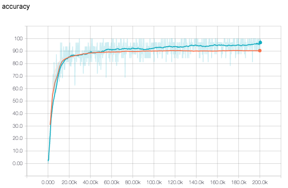

Charts below show accuracy detailed for the first four digits, length, as well as the loss function. It is interesting to see that accuracy for less frequent digit positions (see accuracy digit 3 chart) is not lower, which indicates that digit recognition is independant of the position: the features learned are general to digits, and not specific to a digit position.
Charts for digits at position 4 and 5 are irrelevant as there are not enough occurences.

|   |   |
|---|---|
|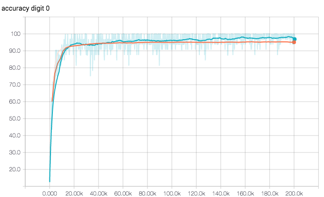  | 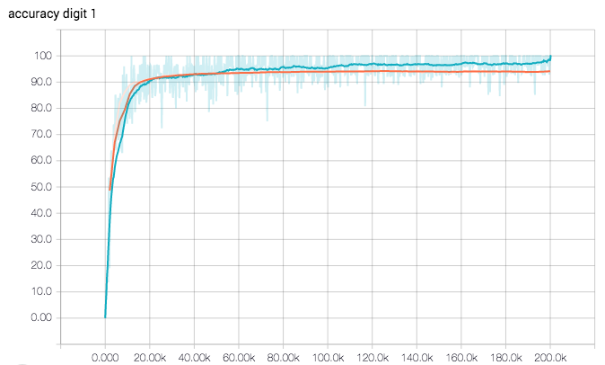 |
|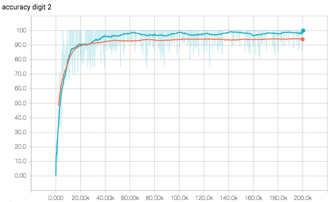  | 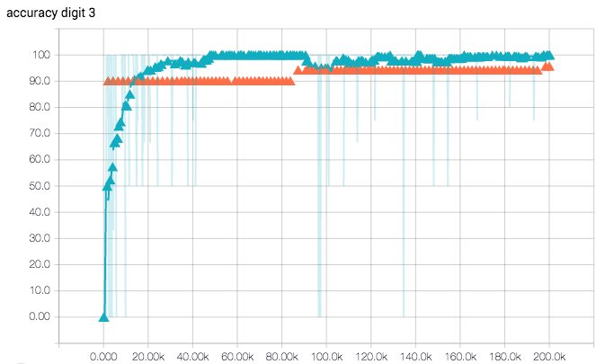 |
|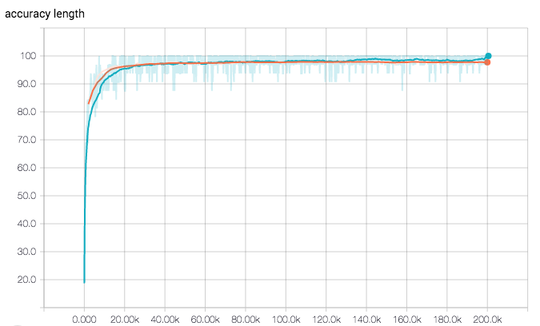  |  |

#### Visualization of the graph

The image below depicts the model's computational graph. It shows the flow of the forward pass with inputs going through layers that finally compute logits that are used in the loss function but also in the inference process to get predictions and evaluate their correctness. It also illustrates the `train_op`, once the loss is computed, modifies the variables during the back propagation.

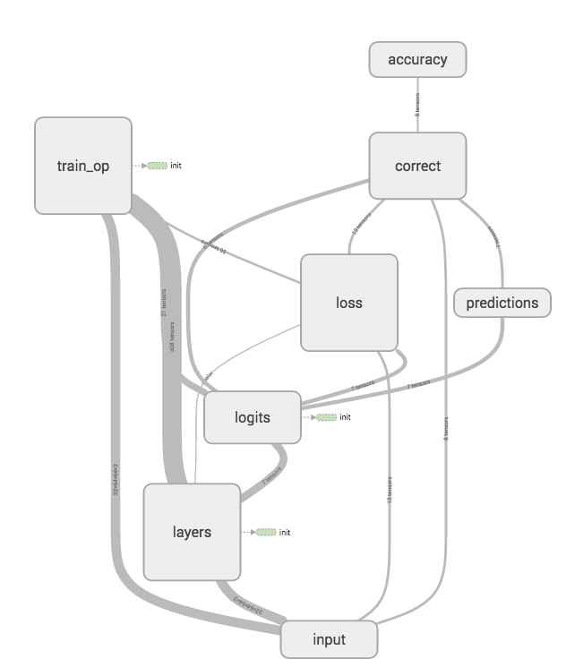

The image belows illustrates how the data flows through the architecture of convolutional layers. Note the side branches indicating L2 loss on weights that is added to the loss (after being multiplied by the weight decay factor).

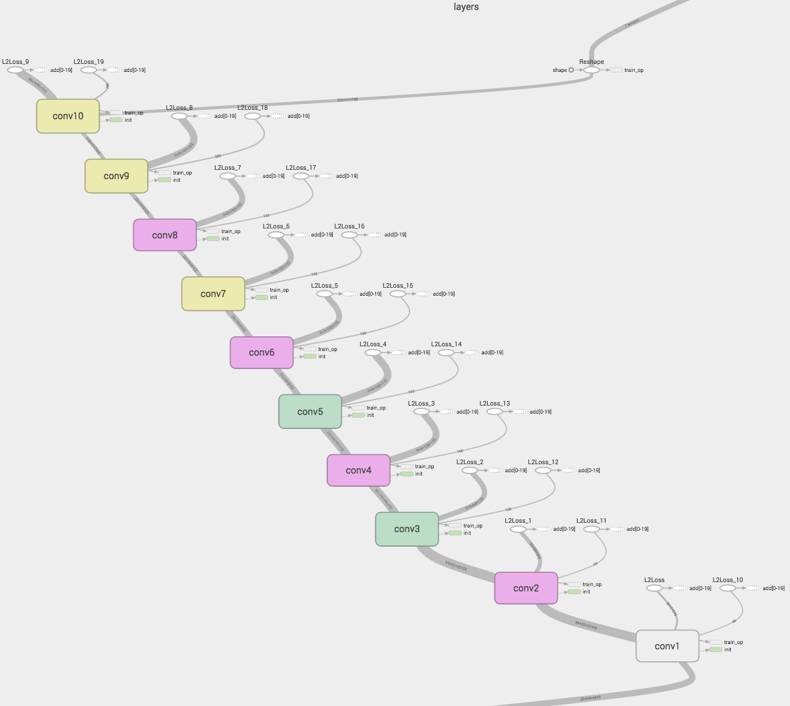

The image below illustrates convolutional layer 3 in detail. The convolution layer is the red oval, then biases are added, relu is applied, then batch normalization, max pooling and dropout.

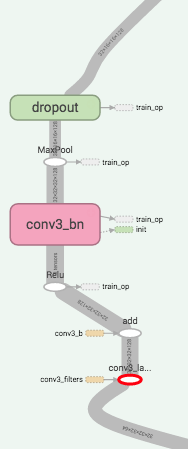

### Reflection

I want to discuss here decisions that have proven not to be optimal.

#### Data preprocessing
I realized later that augmenting the dataset statically was not the way to go. It requires generating all those images and having to deal with tons of gigabytes. Generating `tfrecords` files and uploading them in the Google Storage bucket took more than 12 hours. The main reason I sticked to it is I wanted Kryshevsky's color perturbation scheme which I didn't feel able to implement in Tensorflow directly. My numpy implementation had issues anyways. Even with sigma = 1 I only had marginal and barely noticeable changes.

All in all, applying transformations at training time using TensorFlow's built-in image transformation functions would have been much more efficient, and I could have used built-in random contrast and color perturbations functions.

#### Cloud ML
I thought using a Google product in Beta would be fine, but the combination of Cloud Datalab and Cloud ML has issues that made me waste a lot of time. One example is how I obtained the final results above.

1. A couple of days before submitting the report, Google Cloud upgraded their StackDriver API and TensorFlow's logs are not available anymore. I submitted a [question on StackOverflow](http://stackoverflow.com/questions/41168116/stackdriver-logs-not-available-for-cloud-ml-jobs-since-migration-to-v2/41185588#41185588), two Googlers commented, vaguely suggesting there might be an issue on their side. So I could not read evaluation output in the logs

2. The TensorFlow version running on the cloud is more recent that the one in the Cloud Datalab (Sort of Jupyter notebook in a Docker container with a Tensorflow environment. Required to submit a training job from a notebook to Cloud ML). And checkpoint files produced on the Cloud ML version (0.12) are not readable by the version in the Cloud Datalab Container (0.11), so I could not even evaluate locally the model trained in the cloud (and see evaluation results in local logs)

The only way to get results was to run an evaluation pass on the test set and write a summary file I could open in Tensorboard.

Using a GPU machine on AWS would probably have been easier and faster.

### Improvement

To know what to improve I would need better feedback about the learning process. It would start with better vizualizations of the learning process such as features learned in filters.

### References

1. The Street View House Numbers (SVHN) Dataset : http://ufldl.stanford.edu/housenumbers/
2. Ian J. Goodfellow, Yaroslav Bulatov, Julian Ibarz, Sacha Arnoud, Vinay Shet (2014). Multi-digit Number Recognition from Street View
Imagery using Deep Convolutional Neural Networks http://static.googleusercontent.com/media/research.google.com/fr//pubs/archive/42241.pdf
3. Performance results review on the SVHN dataset http://rodrigob.github.io/are_we_there_yet/build/classification_datasets_results.html#5356484e
4. MNIST dataset: http://yann.lecun.com/exdb/mnist/
5. Dmytro Mishkin, Nikolay Sergievskiy, Jiri Matas (2016). Systematic evaluation of CNN advances on the ImageNet
